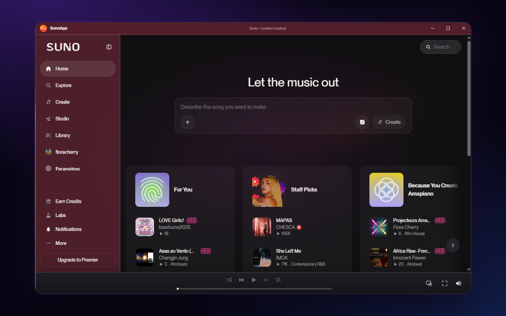

<p align="center">
  
</p>

<h1 align="center">SunoApp</h1>
<p align="center"><strong>GalaxyBunny Studio</strong> · unofficial Windows app for Suno</p>

<p align="center">
  Custom player, mini player, equalizer, GalaxyBunny themes.<br>
  Independent project — not affiliated with Suno.
</p>

<p align="center">
  <a href="https://hanacherry.github.io/SunoApp/?lang=en"></a>
  <a href="https://github.com/HanaCherry/SunoApp/releases/latest"></a>
  <a href="package.json"></a>
</p>

<p align="center">
  <a href="README.md">Français</a> ·
  <a href="README.en.md">English</a> ·
  <a href="https://hanacherry.github.io/SunoApp/?lang=en">All languages on the site</a>
</p>

<p align="center">
  <a href="https://hanacherry.github.io/SunoApp/?lang=en">Presentation site</a>
  ·
  <a href="https://github.com/HanaCherry/SunoApp/releases/latest">Latest release</a>
</p>

<p align="center">
  
</p>

## Suno, in a Windows window

SunoApp wraps Suno in a **desktop app**: custom player, always-on mini player, 10-band equalizer, themes (Night, Light, Cherry, Aurora, Glass Apple, Aero, Music), UI in 31 languages.

**Independent** project by **Flora Cherry** / GalaxyBunny Studio. Not affiliated with or endorsed by Suno.

## Preview

<p align="center">
  
</p>

## Features

- **Custom player** — cover, progress, waveform, dynamic colors
- **Mini player** — always visible, bottom-right
- **Equalizer** — 10 bands, spectrum, reverb, echo
- **GalaxyBunny themes** — Night, Light, Cherry, Aurora, Glass Apple, Aero, Music
- **Windows** — taskbar media controls, session kept
- **31 languages** in the app

## Windows install

1. Open the [latest release](https://github.com/HanaCherry/SunoApp/releases/latest).
2. Download the `.exe` installer.
3. Run it.

Windows SmartScreen may warn you: the app does not have a commercial certificate yet.

## Development

Requires [Node.js 22+](https://nodejs.org).

```sh
git clone https://github.com/HanaCherry/SunoApp.git
cd SunoApp
npm install
npm start
```

Installer:

```sh
npm run dist
```

## Disclaimer

SunoApp is an independent, unofficial project. Suno belongs to its owners.

## License

GalaxyBunny Studio / Flora Cherry project.
