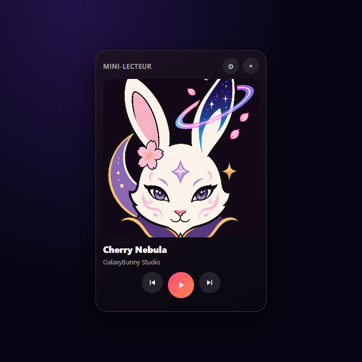

<p align="center">
  
</p>

<h1 align="center">SunoApp</h1>
<p align="center"><strong>GalaxyBunny Studio</strong> · application Windows non officielle pour Suno</p>

<p align="center">
  Lecteur personnalisé, mini-lecteur, égaliseur, thèmes GalaxyBunny.<br>
  Projet indépendant — non affilié à Suno.
</p>

<p align="center">
  <a href="https://hanacherry.github.io/SunoApp/"></a>
  <a href="https://github.com/HanaCherry/SunoApp/releases/latest"></a>
  <a href="package.json"></a>
</p>

<p align="center">
  <a href="README.md">Français</a> ·
  <a href="README.en.md">English</a> ·
  <a href="https://hanacherry.github.io/SunoApp/?lang=es">Español</a> ·
  <a href="https://hanacherry.github.io/SunoApp/?lang=pt">Português</a> ·
  <a href="https://hanacherry.github.io/SunoApp/?lang=de">Deutsch</a> ·
  <a href="https://hanacherry.github.io/SunoApp/?lang=it">Italiano</a> ·
  <a href="https://hanacherry.github.io/SunoApp/?lang=ja">日本語</a> ·
  <a href="https://hanacherry.github.io/SunoApp/?lang=ko">한국어</a> ·
  <a href="https://hanacherry.github.io/SunoApp/?lang=zh">简体中文</a> ·
  <a href="https://hanacherry.github.io/SunoApp/?lang=zh-TW">繁體中文</a> ·
  <a href="https://hanacherry.github.io/SunoApp/?lang=ar">العربية</a> ·
  <a href="https://hanacherry.github.io/SunoApp/?lang=ru">Русский</a> ·
  <a href="https://hanacherry.github.io/SunoApp/?lang=hi">हिन्दी</a> ·
  <a href="https://hanacherry.github.io/SunoApp/?lang=tr">Türkçe</a> ·
  <a href="https://hanacherry.github.io/SunoApp/?lang=pl">Polski</a> ·
  <a href="https://hanacherry.github.io/SunoApp/?lang=nl">Nederlands</a> ·
  <a href="https://hanacherry.github.io/SunoApp/?lang=id">Bahasa Indonesia</a> ·
  <a href="https://hanacherry.github.io/SunoApp/?lang=vi">Tiếng Việt</a> ·
  <a href="https://hanacherry.github.io/SunoApp/?lang=th">ไทย</a> ·
  <a href="https://hanacherry.github.io/SunoApp/?lang=uk">Українська</a> ·
  <a href="https://hanacherry.github.io/SunoApp/?lang=sv">Svenska</a> ·
  <a href="https://hanacherry.github.io/SunoApp/?lang=cs">Čeština</a> ·
  <a href="https://hanacherry.github.io/SunoApp/?lang=ro">Română</a> ·
  <a href="https://hanacherry.github.io/SunoApp/?lang=el">Ελληνικά</a> ·
  <a href="https://hanacherry.github.io/SunoApp/?lang=hu">Magyar</a> ·
  <a href="https://hanacherry.github.io/SunoApp/?lang=fi">Suomi</a> ·
  <a href="https://hanacherry.github.io/SunoApp/?lang=da">Dansk</a> ·
  <a href="https://hanacherry.github.io/SunoApp/?lang=no">Norsk</a> ·
  <a href="https://hanacherry.github.io/SunoApp/?lang=he">עברית</a> ·
  <a href="https://hanacherry.github.io/SunoApp/?lang=ca">Català</a> ·
  <a href="https://hanacherry.github.io/SunoApp/?lang=ms">Bahasa Melayu</a> ·
  <a href="https://hanacherry.github.io/SunoApp/?lang=tl">Filipino</a>
</p>

<p align="center">
  <a href="https://hanacherry.github.io/SunoApp/">Site de présentation</a>
  ·
  <a href="https://github.com/HanaCherry/SunoApp/releases/latest">Dernière release</a>
</p>

<p align="center">
  
</p>

## Suno, dans une fenêtre Windows

SunoApp enveloppe Suno dans une **application de bureau** : lecteur personnalisé, mini-lecteur toujours visible, égaliseur 10 bandes, thèmes (Nuit, Clair, Cherry, Aurore, Glass Apple, Aero, Musique), interface en 31 langues.

Projet **indépendant**, développé par **Flora Cherry** / GalaxyBunny Studio. Non affilié, non approuvé par Suno.

## Aperçu

<p align="center">
  
</p>

<p align="center">
  
</p>

## Fonctions

- **Lecteur personnalisé** — pochette, progression, forme d’onde, couleurs dynamiques
- **Mini-lecteur** — toujours visible, bas droite
- **Égaliseur** — 10 bandes, spectre, réverbe, écho
- **Thèmes GalaxyBunny** — Nuit, Clair, Cherry, Aurore, Glass Apple, Aero, Musique
- **Windows** — contrôles multimédias dans la barre des tâches, session conservée
- **31 langues** dans l’application

## Installation Windows

1. Ouvrez la [dernière release](https://github.com/HanaCherry/SunoApp/releases/latest).
2. Téléchargez l’installateur `.exe`.
3. Lancez-le.

Windows SmartScreen peut afficher un avertissement : l’application n’a pas encore de certificat commercial.

## Développement

Prérequis : [Node.js 22+](https://nodejs.org).

```sh
git clone https://github.com/HanaCherry/SunoApp.git
cd SunoApp
npm install
npm start
```

Installateur :

```sh
npm run dist
```

## Avertissement

SunoApp est un projet indépendant et non officiel. Suno appartient à ses détenteurs.

## Licence

Projet GalaxyBunny Studio / Flora Cherry.
